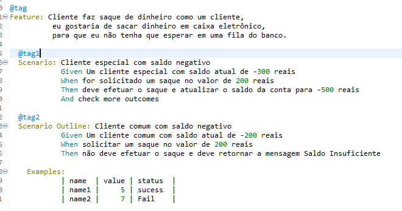

# TQS-ContaBancaria

## Description
O código a seguir foi desenvolvido no eclipse para realizar testes em um cenario de transações bancárias simples para dois tipos de clientes, especiais e normais.
## Tests

## Clients

## Última atualização 30/11/2023

